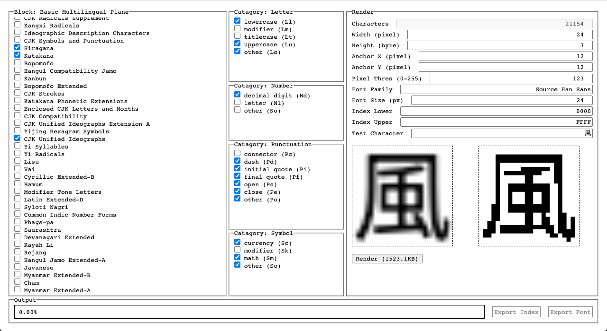

# monofont
Binary font rendering for embedded OLED screens

### Usage

Download the bundled `monofont.html` from the [releases](https://github.com/akiroz/monofont/releases)
and open locally in Chrome or Firefox.

After rendering, 2 files are generated:

- `font.index.bin`: (Int32Array) Index for mapping Unicode code-points to offsets in the data file.
    A value of `-1` indicates the char data for that code-point does not exist in the data file.
    Byte width of each character is simply width (px) * height (bytes).
- `font.data.bin`: (UInt8Array) Bitmap image data for each character in LCD/OLED byte order.
    (Ref: https://learn.sparkfun.com/tutorials/microview-hookup-guide/oled-memory-map)
